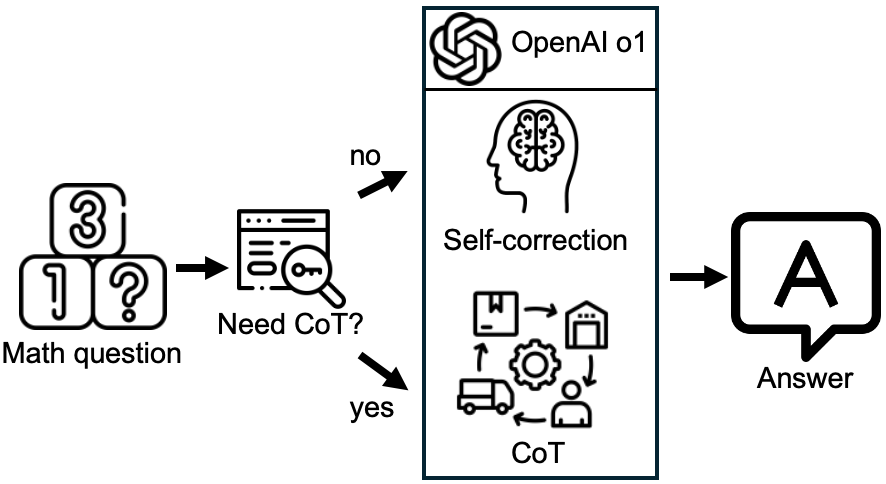

# 基于LLMs的组合数学解题能力优化研究

作者：张清杰，张茂森

我们提供两种代码：
- 最终方案代码
- LLM评测代码
  
代码内提供了API key，使用上限是100美元，足够跑所有实验。

代码均设置中断恢复机制，如因网络问题意外中断，重新运行相同指令即可在中断位置恢复实验。

执行代码前首先需要安装依赖：
```bash
conda create -n zuhe python=3.9 -y  # Python >= 3.9 required
conda activate zuhe
pip install -r requirements.txt
```

## 最终方案：o1 + CoT + Self-correction


结合报告中的优化方案和最优评测结果，我们的最终方案如上图所示：
- 以o1为基础模型。
- 判断问题是否为多面体转动群问题：是否同时包含关键词“面体”和“边形”。
- 如果是，采用CoT优化方法。
- 如果不是，采用Self-correction优化方法。

最终方案代码：
- 需要设置expPath为保存结果的路径。
- 会在expPath下生成res.jsonl文件，其中'answer'字段为LLM的回答。
- 针对不同数据集有三种使用方式：
  - 在测试样例上执行：
  ```bash
  python solve.py --dataset "test" --expPath "./exp/test/finalMethod"
  ```
  - 在期末试题上执行：
  ```bash
  python solve.py --dataset "exam" --expPath "./exp/exam/finalMethod"
  ```
  - 如果想在新的数据集上测试，需要自行准备数据集（格式需要与测试样例中的".json"文件格式一致），并设置newDataPath：
  ```bash
  python solve.py --dataset "new" --expPath "./exp/new/finalMethod" --newDataPath "./dataset/new.json"
  ```


数据集的格式举例如下：
- "1", "2"为题目编号。
- "problem"为问题。
- "answers"为参考答案，可不提供。
```json
{
  "1": {
    "problem": "在一局乒乓球比赛中，先得 11 分的一方为胜方，10 平后，先多得 2 分的一方为胜方，某场比赛中某选手始终未落后过，最后以 12:10 战胜对手，在比赛过程中没有出现 5:5 及 9:9，有多少可能的表示比赛过程的比分记录？(18分)",
    "answers": {
      "(1)": [
        {
          "answer": "$$\\begin{align}[\\mathsf{C}(20,10)-\\mathsf{C}(20,9)]-[\\mathsf{C}(10,5)-\\mathsf{C}(10,4)][\\mathsf{C}(10,5)-\\mathsf{C}(10,4)] -[\\mathsf{C}(18,9)\\mathsf{-C}(18,8)][\\mathsf{C}(2,1)\\mathsf{-C}(1,1)] +[C(10,5)-C(10,4)][C(8,4)-C(8,3)][C(2,1)-C(1,1)]\\end{align}$$"
        }
      ]
    }
  },
  "2": {
    "problem": "搭积木。  1）用 $2\times 1$ 的砖，铺 $2\times n$ 的路，请问有多少种不同的方案？（12 分） 2）现在要用 $2\times1\times1$ 的积木搭成 $2\times2\times n$ 的柱子。柱子有方向而积木没有方向。请给出 $n>2$ 时，这个问题的递推关系（包含必要的初值，其中 $a_0=1$）。（提示，不需要算出通项公式，你可能还需要 $b_n$）（10 分）",
    "answers": {
      "(1)": [
        {
          "answer": "Fibonacci"
        }
      ],
      "(2)":[
        {
          "answer": "令 $a_n$ 为搭成 $2\times2\times n$ 的柱子的方案数而 $b_n$ 为搭成 $2\times 2$ 的柱子，半边是 n 层，半边是 n-1 层竖向摆放两块积木直接叠到 n+1 层的方案数（2 分）满足如下递推关系（4 分，每条 2 分）$b_n = b_{n−1} + a_{n−1}$：拿掉两竖后，另外一边 n 层可能是一横（$a_{n−1}$）或两竖（bn−1）$a_n = 4b_{n−1} + 2a_{n−1} + a_{n−2}$ ：最上层可能是四竖（$a_{n−2}$），两横（$2a_{n−1}$）或者一横两竖（$4b_{n−1}$）消掉 $b_n$ 得到 $a_n = 3a_{n−1} + 3a_{n−2} − a_{n−3}(n>2)$（1 分）n=2 时有 9 种。（3 分）四横：每层有两种可能，共 4 种； 两竖两横：共有四种朝向，共 4 种；四竖：共 1 种。 n=2 时有 9 种, a0=1,a1=2;a2=9"
        }
      ]
    }
  }
}
```


## LLM评测
对于包含打分规则的数据集（例如测试样例），我们提供了LLM评测代码:
```bash
python LLMevaluate.py --resPath "./exp/test/finalMethod/res.jsonl"
```
- 该代码会读取测试样例中的打分规则，并自动计算打分。
- 我们需要设置resPath为需要被打分的回答文件。
- 该代码在执行结束时会在终端打印出最终得分，并在resPath的相同路径下生成一个后缀为“_pigai.jsonl”的文件，其中'score'字段为每道题LLM的打分，'scoreReason'字段为打分分析过程。

